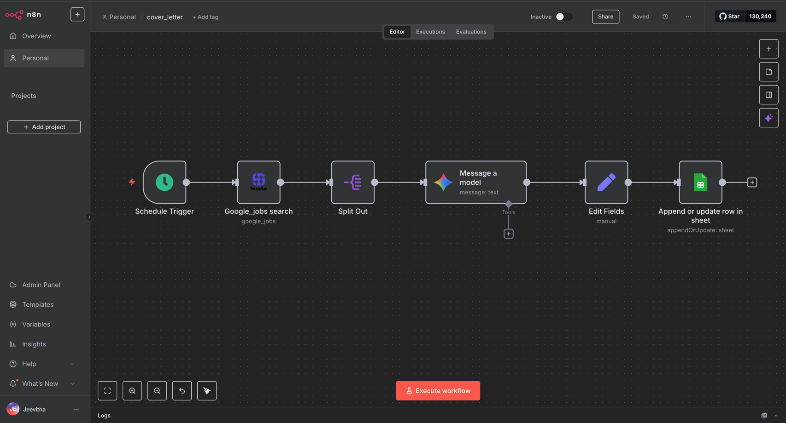

# 🚀 Automated Job Search and Cover Letter Generator using n8n

This project automates the job search and application process using n8n and Gemini 2.5 Flash.
It automatically fetches job listings from Google Jobs (via SerpAPI), generates personalized cover letters with Gemini, and appends all results into Google Sheets every day at 10 AM.

The workflow helps save time, ensures consistency, and organizes applications neatly in one place.

## ⚙️ Workflow Steps

- Trigger (Cron)

- Runs every day at 10:00 AM (IST) automatically.

- Google Jobs Search (SerpAPI)

- Fetches fresh job postings based on query keywords and location.

- Output includes: title, company_name, location, description, job_url.

- AI Cover Letter Generation (Gemini 2.5 Flash)

- Sends job details + your skills to Gemini 2.5 Flash.

- Generates a tailored cover letter for each role.

## Prompt Example:

ROLE: You write concise, professional cover letters tailored to each job.
STYLE: 180–250 words, clear, achievement-focused, Indian English.
INCLUDE: A 3–4 bullet “Why I fit” section. Don’t invent experience.

CANDIDATE SKILLS:
{{ $json.skills }}

JOB
Title: {{ $json.title }}
Company: {{ $json.company_name }}
Location: {{ $json.location }}
Description: {{ $json.description }}
Link: {{ $json.job_url }}

TASK: Write the cover letter to the hiring team (<=250 words).

## Google Sheets Logging

Appends each job entry into Google Sheets.

Columns:

Date (IST)

Job Title

Company

Location

Job URL

Description

Cover Letter

## 🛠️ Tech Stack

n8n – Workflow automation

Google Jobs (SerpAPI) – Job data source

Gemini 2.5 Flash – AI model for cover letter generation

Google Sheets – Data logging & storage

## 📊 Benefits

⏱ Time Saved – No manual searching or rewriting applications.

🎯 Consistency – Every job gets a polished, personalized cover letter.

📊 Organization – All job opportunities stored in a single Google Sheet for review.

## 🚀 How to Run

- Install & Setup n8n

- Use n8n Cloud or self-host.

- Create Credentials

- Add Google Sheets API credentials.

- Add SerpAPI Key.

- Add Google AI (Gemini) API Key.

- Import Workflow

- Import the provided n8n JSON file.

- Configure Sheet

- Create a Google Sheet with the required columns.

- Update the workflow to point to your sheet.

- Enable the Cron node for daily automation.

## 📌 Example Output (Google Sheets)
Date (IST)	Title	Company	Location	Job URL	Cover Letter

## 📢 Conclusion

This project demonstrates how AI + automation can simplify real-world challenges like job search and applications. By combining n8n workflows, SerpAPI job data, Gemini intelligence, and Google Sheets logging, the entire process becomes faster, smarter, and more consistent.
